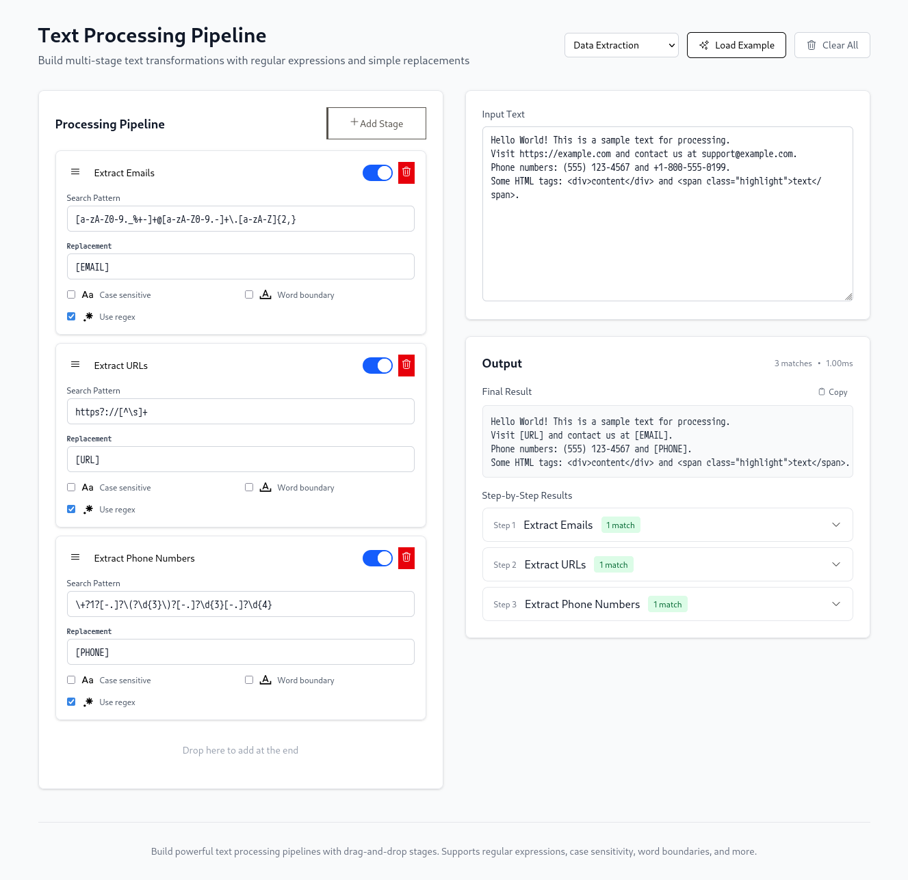

# Text Processing Pipeline / テキスト処理パイプライン

[English](#english) | [日本語](#japanese)

---

## English



A powerful multi-stage text transformation tool built with Qwik, featuring a drag-and-drop interface for creating complex text processing pipelines with regular expressions.

### 🚀 Features

- **Multi-stage Pipeline**: Create complex text transformations by chaining multiple processing stages
- **Drag & Drop Interface**: Intuitive reordering of pipeline stages with visual feedback
- **Real-time Preview**: See transformation results instantly as you build your pipeline
- **Regular Expression Support**: Use powerful regex patterns or simple text replacements
- **Step-by-step Visualization**: View intermediate results at each processing stage
- **Advanced Options**: Configure case sensitivity, word boundaries, and more
- **Dark Mode Support**: Beautiful UI that adapts to your system preferences

### 🛠️ Technology Stack

- **Framework**: [Qwik](https://qwik.builder.io/) - Resumable JavaScript framework
- **Styling**: [Tailwind CSS](https://tailwindcss.com/) v4 with custom theming
- **Icons**: Heroicons via Tailwind CSS Icons
- **Type Safety**: TypeScript for robust development
- **Build Tool**: Vite for fast development and optimized builds

### 📦 Getting Started

#### Prerequisites

- Node.js LTS
- pnpm (recommended) or npm

### 🎯 Usage

1. **Enter Text**: Paste or type your text in the input area
2. **Add Stages**: Click "Add Stage" to create new processing steps
3. **Configure**: Set up patterns, replacements, and options for each stage
4. **Reorder**: Drag and drop stages to change processing order
5. **Preview**: See real-time results and intermediate steps
6. **Export**: Copy the final output or individual stage results

### 🏗️ Project Structure

```text
src/
├── components/
│   ├── pipeline/          # Pipeline management components
│   ├── text-processor/    # Text input/output components
│   └── starter/           # Qwik starter components
├── routes/
│   ├── index.tsx          # Landing page
│   └── text-processor/    # Main application
├── types/
│   └── pipeline.ts        # TypeScript type definitions
└── utils/
    ├── text-processor.ts  # Core processing logic
    └── drag-drop.ts       # Drag and drop utilities
```

### 📄 License

This project is open source and available under the [AGPL License](LICENSE).

---

## Japanese

Qwikで構築された強力なマルチステージテキスト変換ツールです。正規表現を使用した複雑なテキスト処理パイプラインを作成するためのドラッグ&ドロップインターフェースを備えています。

### 🚀 機能

- **マルチステージパイプライン**: 複数の処理ステージを連鎖させて複雑なテキスト変換を作成
- **ドラッグ&ドロップインターフェース**: 視覚的フィードバック付きでパイプラインステージを直感的に並び替え
- **リアルタイムプレビュー**: パイプラインの構築中に変換結果を即座に確認
- **正規表現サポート**: 強力な正規表現パターンまたはシンプルなテキスト置換を使用
- **ステップバイステップ可視化**: 各処理ステージでの中間結果を表示
- **高度なオプション**: 大文字小文字の区別、単語境界などを設定可能
- **ダークモードサポート**: システム設定に適応する美しいUI

### 🛠️ 技術スタック

- **フレームワーク**: [Qwik](https://qwik.builder.io/) - 再開可能なJavaScriptフレームワーク
- **スタイリング**: [Tailwind CSS](https://tailwindcss.com/) v4 とカスタムテーマ
- **アイコン**: Tailwind CSS Icons経由のHeroicons
- **型安全性**: 堅牢な開発のためのTypeScript
- **ビルドツール**: 高速開発と最適化されたビルドのためのVite

### 📦 始め方

#### 前提条件

- Node.js LTS
- pnpm（推奨）またはnpm

### 🎯 使用方法

1. **テキスト入力**: 入力エリアにテキストを貼り付けまたは入力
2. **ステージ追加**: 「Add Stage」をクリックして新しい処理ステップを作成
3. **設定**: 各ステージのパターン、置換、オプションを設定
4. **並び替え**: ステージをドラッグ&ドロップして処理順序を変更
5. **プレビュー**: リアルタイムの結果と中間ステップを確認
6. **エクスポート**: 最終出力または個別のステージ結果をコピー

### 🏗️ プロジェクト構造

```text
src/
├── components/
│   ├── pipeline/          # パイプライン管理コンポーネント
│   ├── text-processor/    # テキスト入力/出力コンポーネント
│   └── starter/           # Qwikスターターコンポーネント
├── routes/
│   ├── index.tsx          # ランディングページ
│   └── text-processor/    # メインアプリケーション
├── types/
│   └── pipeline.ts        # TypeScript型定義
└── utils/
    ├── text-processor.ts  # コア処理ロジック
    └── drag-drop.ts       # ドラッグ&ドロップユーティリティ
```

### 📄 ライセンス

このプロジェクトはオープンソースで、[AGPLライセンス](LICENSE)の下で利用可能です。
